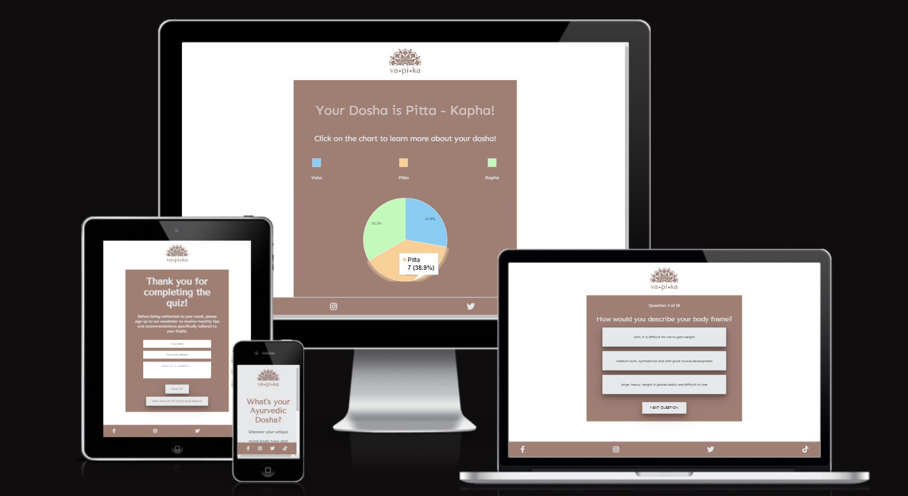
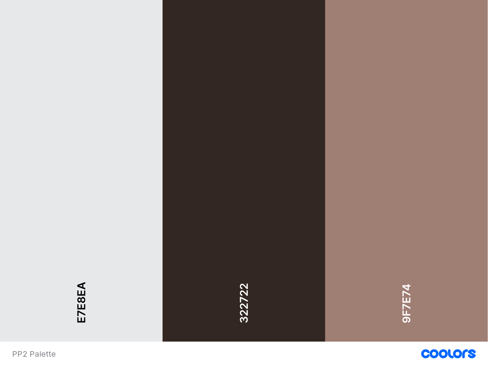

# VAPIKA Dosha Quiz

**A Quiz to discover your Ayurvedic Dosha**

[View the live website here](https://lestece.github.io/VAPIKA-Dosha-Quiz/)

## TABLE OF CONTENTS

1. [INTRODUCTION](#1-introduction)
2. [USER EXPERIENCE DESIGN](#2-user-experience-design)
   - [User persona & their goals/needs](#user-persona--their-goalsneeds)
   - [Business goals](#business-goals)
   - [Wireframes](#wireframes)
   - [Design](#design)
     - [Logo](#logo)
     - [Colors](#colors)
     - [Icons](#icons)
     - [Typography](#typography)
     - [Images](#images)
     - [Mockups](#mockups)
3. [FEATURES](#3-features)
   - [Existing features](#existing-features)
   - [Features to implement in the future](#features-to-implement-in-the-future)
4. [TESTING](#4-testing)
5. [TECHNOLOGIES USED](#5-technologies-used)
   - [Main languages used](#main-languages-used)
   - [Frameworks, Libraries and Programs used](#frameworks-libraries-and-programs-used)
6. [CREDITS](#6-credits)
7. [DEPLOYMENT](#7-deployment)
8. [ACKNOWLEDGEMENTS](#8-acknowledgements)

## 1. INTRODUCTION

This is an interactive front-end site created to provide users with a quiz __to discover their unique Ayurvedic Dosha and obtain lifestyle/diet recommendations based on the quiz result__.

The quiz contains 18 questions and each questions has 3 different answer options, that correspond to a specific dosha. 

The result is based on which doshas score the highest points in the quiz.

I've created this quiz to showcase my HTML, CSS and JavaScript knowledge, along with my skills relating responsitivity, accessibility and UX Design.

[Back to top ↑](README.md/#vapika-dosha-quiz)

## 2. USER EXPERIENCE DESIGN

### USER PERSONA & THEIR GOALS/NEEDS

Users are adults who want to:

- discover their unique mind-body composition
- get clear and concise information about what the quiz does and how to use the results
- take a quiz that is not too time consuming (avoid too many questions)
- have the option to subscribe to the Newsletter and discover/learn more about their results
- have the option to opt out of the Newsletter
- being redirected to an interactive/engaging result after taking the quiz, where information given is not too crowded but clear and controlled by the user input
- being left with the feeling of knowing more about themselves after taking the quiz and more knowledgeable about how to tackle possible health issues

[Back to top ↑](README.md/#vapika-dosha-quiz)

### BUSINESS GOALS

- to provide users with a quiz to discover their dosha and interactive/entertaining information about Ayurveda
- promote the brand name so that in the future it could become a wider Ayurvedic services provider
- keep the users engaged with the brand through a subscription to a monthly Newsletter

[Back to top ↑](README.md/#vapika-dosha-quiz)

### WIREFRAMES

[See wireframes here](docs/wireframes).

All wireframes were created with [Figma](https://www.figma.com/).

[Back to top ↑](README.md/#vapika-dosha-quiz)

### DESIGN

- #### LOGO

VAPIKA logo was created by me using [Canva](https://www.canva.com/).

- #### COLORS

The palette was generated from the background image found in the desktop design using [Coolors](https://coolors.co/).

- __#9F7E74 (beige color)__ has been used for the logo, some backgrounds in the website (buttons and main container), for most headings and for the footer background. Also used as a text color when the background is the color below;

- __#E7E8EA (grey/white color)__ was mostly used in the text appearing on backgrounds of the color stated above (quiz questions, sign up form and results heading), for some other backgrounds (buttons, body background), social media icons in the footer;

- I wanted to keep a good contrast across all of the pages and their elements so a regular __black color__ was used for most of the paragraphs, and for some buttons text. 
 

[Back to top ↑](README.md/#vapika-dosha-quiz)

- #### ICONS
  Icons were needed for the social media links and have been taken from [FontAwesome](https://fontawesome.com/).

[Back to top ↑](README.md/#vapika-dosha-quiz)

- #### TYPOGRAPHY

The chosen fonts for the website are:

1. **Tenor Sans**: used for the headings, it's an elegant sans-serif designed by Denis Masharov with excellent legibility.

2. **Sen**: a friendly sans-serif used for paragraphs due to its easy readability.

[Back to top ↑](README.md/#vapika-dosha-quiz)

- #### IMAGES

The image used for the homepage background for large screen designs, was taken from [Unsplash](https://unsplash.com/).

The images representing the natural elements that introduce each dosha result were created by me using [Canva](https://www.canva.com/).

All images were optimized using [TinyPNG](https://tinypng.com/).

[Back to top ↑](README.md/#vapika-dosha-quiz)

- #### MOCKUPS

After ideating the website structure and the wireframes, and after having decided the design elements, I've created high-fidelity mockups of all of the pages to make tangible the idea in my mind and have a detailed guide to follow when coding.

[See mockups here](docs/mockups)

[Back to top ↑](README.md/#vapika-dosha-quiz)

## 3. FEATURES

### EXISTING FEATURES

### FEATURES TO IMPLEMENT IN THE FUTURE

## 4. TESTING

## 5. TECHNOLOGIES USED

### Main languages used

### Frameworks, Libraries and Programs used

## 6. CREDITS

## 7. DEPLOYMENT

## 8. ACKNOWLEDGEMENTS
