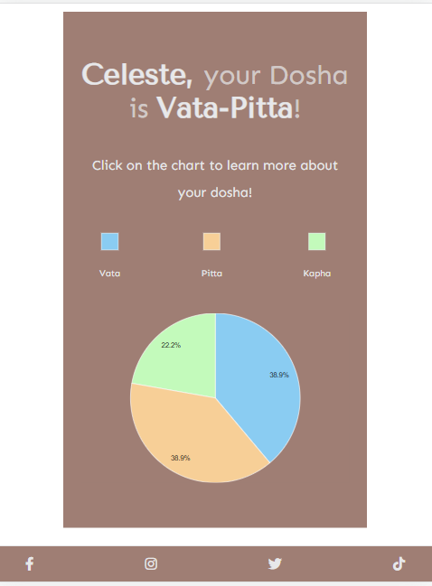

# VAPIKA Dosha Quiz

**A Quiz to discover your Ayurvedic Dosha**

[View the live website here](https://lestece.github.io/VAPIKA-Dosha-Quiz/)

## TABLE OF CONTENTS

1. [INTRODUCTION](#1-introduction)
2. [USER EXPERIENCE DESIGN](#2-user-experience-design)
   - [User persona & their goals/needs](#user-persona--their-goalsneeds)
   - [Business goals](#business-goals)
   - [Wireframes](#wireframes)
   - [Design](#design)
     - [Logo](#logo)
     - [Colors](#colors)
     - [Icons](#icons)
     - [Typography](#typography)
     - [Images](#images)
     - [Mockups](#mockups)
3. [FEATURES](#3-features)
   - [Existing features](#existing-features)
   - [Features to implement in the future](#features-to-implement-in-the-future)
4. [TESTING](#4-testing)
5. [TECHNOLOGIES USED](#5-technologies-used)
   - [Main languages used](#main-languages-used)
   - [Frameworks, Libraries and Programs used](#frameworks-libraries-and-programs-used)
6. [CREDITS](#6-credits)
7. [DEPLOYMENT](#7-deployment)
8. [ACKNOWLEDGEMENTS](#8-acknowledgements)
- - -
## 1. INTRODUCTION

This is an interactive front-end site created to provide users with a quiz __to discover their unique Ayurvedic Dosha and obtain lifestyle/diet recommendations based on the quiz result__.

The quiz contains 18 questions and each questions has 3 different answer options, that correspond to a specific dosha. 

The result is based on which doshas score the highest points in the quiz.

I've created this quiz to showcase my HTML, CSS and JavaScript knowledge, along with my skills relating responsitivity, accessibility and UX Design.
- - - 
## 2. USER EXPERIENCE DESIGN

### USER PERSONA & THEIR GOALS/NEEDS

Users are adults who want to:

- discover their unique mind-body composition
- get clear and concise information about what the quiz does and how to use the results
- take a quiz that is not too time consuming (avoid too many questions)
- have the option to subscribe to the Newsletter and discover/learn more about their results
- have the option to opt out of the Newsletter
- being redirected to an interactive/engaging result after taking the quiz, where information given is not too crowded but clear and controlled by the user input
- being left with the feeling of knowing more about themselves after taking the quiz and more knowledgeable about how to tackle possible health issues

- - - 
### BUSINESS GOALS

- to provide users with a quiz to discover their dosha and interactive/entertaining information about Ayurveda
- promote the brand name so that in the future it could become a wider Ayurvedic services provider
- keep the users engaged with the brand through a subscription to a monthly Newsletter
- - -
### WIREFRAMES

[See wireframes here](docs/wireframes).

All wireframes were created with [Figma](https://www.figma.com/).

[Back to top ↑](README.md/#vapika-dosha-quiz)
- - - 
### DESIGN

- #### LOGO

VAPIKA logo was created by me using [Canva](https://www.canva.com/).

- - - 
- #### COLORS

The palette was generated from the background image found in the desktop design using [Coolors](https://coolors.co/).

- __#9F7E74 (beige color)__ has been used for the logo, some backgrounds in the website (buttons and main container), for most headings and for the footer background. Also used as a text color when the background is the color below;

- __#E7E8EA (grey/white color)__ was mostly used in the text appearing on backgrounds of the color stated above (quiz questions, sign up form and results heading), for some other backgrounds (buttons, body background), social media icons in the footer;

- I wanted to keep a good contrast across all of the pages and their elements so a regular __black color__ was used for most of the paragraphs, and for some buttons text. 
 
- - -

- #### ICONS
  Icons were needed for the social media links and have been taken from [FontAwesome](https://fontawesome.com/).

- - - 
- #### TYPOGRAPHY

The chosen fonts for the website are:

1. **Tenor Sans**: used for the headings, it's an elegant sans-serif designed by Denis Masharov with excellent legibility.

2. **Sen**: a friendly sans-serif used for paragraphs due to its easy readability.

- - - 
- #### IMAGES

The image used for the homepage background for large screen designs, was taken from [Unsplash](https://unsplash.com/).

The images representing the natural elements that introduce each dosha result were created by me using [Canva](https://www.canva.com/).

All images were optimized using [TinyPNG](https://tinypng.com/).

- - - 
- #### MOCKUPS

After ideating the website structure and the wireframes, and after having decided the design elements, I've created high-fidelity mockups of all of the pages to make tangible the idea in my mind and have a detailed guide to follow when coding.

[See mockups here](docs/mockups)

[Back to top ↑](README.md/#vapika-dosha-quiz)
- - - 
## 3. FEATURES

### EXISTING FEATURES

- #### HOMEPAGE

The homepage contains:

- a __catchy introduction__ that informs users about the website main purpose 

- a button that opens a modal window containing __more information__ about Ayurveda and generalities that are important for understanding the quiz results

- a button opening a modal window that provides users with instructions on __how to take the quiz__

- a button to __start the quiz__
- - - 
- #### HOMEPAGE MODAL WINDOWS

For easy navigation, modal windows opened through the "Learn more" and "Instructions" buttons in the homepage __can be closed both by clicking on the "close x button" and by clicking anywhere outside of the modal window__.
- - - 
- #### QUIZ PAGE

The quiz page displays each question and its related 3 different answers one below another.

When the "next" button is clicked, the JavaScript _checks that an answer has been selected_ and if so, _the selected answer gets stored and the next question displayed_.
- - - 
- #### ANSWER SELECTION/UNSELECTION

Event listeneres related to the answer selection are only applied to "next question" button, so that _users can change their mind after selecting one answer and controlling when they're ready to submit their answer and proceed with the next question_.

In case users selected a different answer, __the previous selected one gets unselected__.
- - - 
- #### UNANSWERED QUESTION

For the purpose of getting an accurate result, the quiz is structured so that __each question requires an answer__.

If users try to skip a question or forget to select an answer, __an alert window is displayed__ to inform them about the quiz requirements and prompt them to answer.
- - - 
- #### NEWSLETTER SIGNUP FORM

After the quiz completion, users are redirected to a page containing a _Newsletter signup form_ that requires them to input their _name, email address and a quiz feedback_.

The Newsletter signing up is completely __optional__ and users can skip it by simply clicking on the "Skip and go to results button".
- - - 
- #### NEWSLETTER SIGNUP CONFIRMATION ALERT WINDOW

If the form is correctly submitted, __an alert window confirms users that they've successfully subscribed to the Newsletter__.

With a _4 seconds timer_, the alert window __redirects to the results page__.
- - - 
- #### NEWSLETTER SIGNUP CONFIRMATION EMAIL

If the form is successfully submitted, __users also get a personalized confirmation email__ that displays their name and lets them know what to expect from the Newsletter.
- - - 

- #### QUIZ RESULT PAGE

After introducing the users to their dosha, the quiz result page __features a Google Pie chart__ that displays on what percentage each dosha has been scored.

A _color legend_ helps the user understanding the Pie chart more.
- - -
- #### PERSONALIZED RESULTS

If the user decides to signup to the Newsletter, the __username submitted through the form is stored and displayed in the heading of the results page__. This creates more _emotional engagement_ and the user is reassured that he/she is getting a _tailored result_.

- - - 

- #### INTERACTIVE PIE CHART

The Pie Chart used to display the quiz results is __fully interactive__: 

- by __hovering__ on each slice, the user gets __the name of the dosha__, it's corresponding __number of questions answered __and, based on the number of the quiz total question, on what __percentage__ that dosha is present.

- by __cliking__ on each slice, a __modal window opens__, giving the user a __full explanation of that specific dosha, and tips and recommendations to keep it in balance__.
- - - 
- #### FOOTER

The footer is consistent across all of the pages and contains the social media buttons that open on a new page.

[Back to top ↑](README.md/#vapika-dosha-quiz)
- - - 

### FEATURES TO IMPLEMENT IN THE FUTURE

- Adding e-commerce functionality through expanding each dosha detailed explanation and "remedies" by offering a selection of Ayurvedic products that can help balancing that dosha. 

- Changing the question answering system: instead of having to click on the "next question" button at each question, the clicked answer is the one that triggers the new question displaying.
In addition, the user would be able to go back to the previous questions and, for any reason, change the answer given.

[Back to top ↑](README.md/#vapika-dosha-quiz)
- - - 

## 4. TESTING

All of the information regarding the testing can be found [here](TESTING.md).

- - - 
## 5. TECHNOLOGIES USED

### Main languages used
- HTML
- CSS
- JAVASCRIPT
### Frameworks, Libraries and Programs used
- [GitPod](https://gitpod.io): used for writing this website code, committing and pushing to GitHub.
- [GitHub](https://github.com/): used for hosting, storing and deploying the project
- [Figma](https://www.figma.com/): used for designing the wireframes and mockups for the website in the first phase of the development process
- [Coolors](https://coolors.co/): to generate the color palette from the background image found in the homepage for desktop
- [Canva](https://www.canva.com/): for creating the website logo and the dosha introductive images representing the elements
- [Google Fonts](https://fonts.google.com/): used for importing the fonts for this  website ("Tenor Sans" and "Sen") into the CSS file
- [FontAwesome](https://fontawesome.com/): used for the social media icons
- [Flaticon.com](https://www.flaticon.com/): used for the title bar icon
- [Icoconverter.com](https://www.icoconverter.com/): used for converting the title bar icon into the .ico format
- [GifCap (by João Moreno)](https://gifcap.dev/): used for creating the gifs from the screen recordings during the testing process (for the TESTING.md) and for this README file.
- [Freeformatter.com](https://freeformatter.com/): used for formatting all of the HTML pages
- [Cleancss.com](https://www.cleancss.com/): used for formatting the styles.css file
- [Beautifier.io](https://beautifier.io/): for beautifying/formatting all the Javascript code 
- [AmIResponsive](https://ui.dev/amiresponsive): used for capturing a screenshot of how the website look on different screen sizes (screenshot that introduces this README file)
- [Unsplash](https://unsplash.com/): where the background image in the homepage for large screen was taken from
- [TinyPNG](https://tinypng.com/): used for compressing and optimizing all of the images used in the website
- [Google Charts](https://developers.google.com/chart): used for implementing the Pie Chart that displays the doshas in the results page
- [SweetAlert](https://sweetalert.js.org/guides/): used for the alert window that shows up when a quiz questions is attempted to be skipped
- [SweetAlert2](https://sweetalert2.github.io/):for implementing the alert window containing a timer that follows the signup button on click and redirects to the results page
- [EmailJS](https://www.emailjs.com/): used for sending an automatic/personalized email to users when they submit the signup form

[Back to top ↑](README.md/#vapika-dosha-quiz)
- - - 

## 6. CREDITS

## 7. DEPLOYMENT

## 8. ACKNOWLEDGEMENTS
