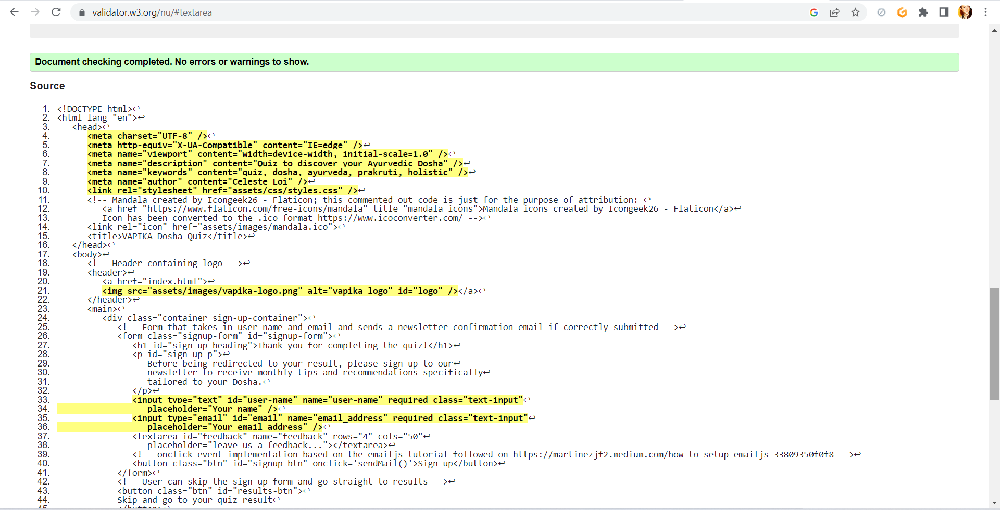
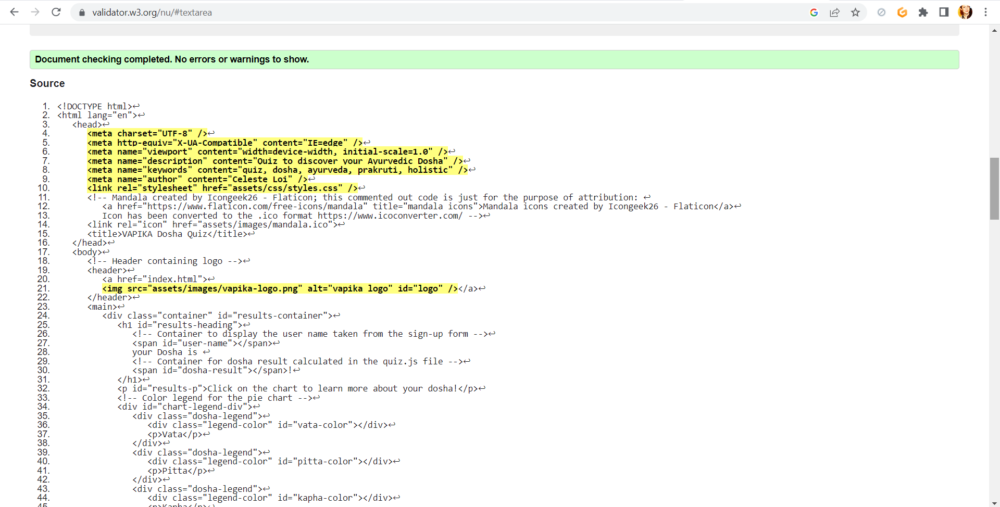
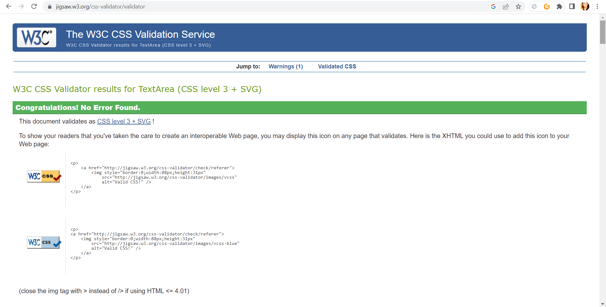
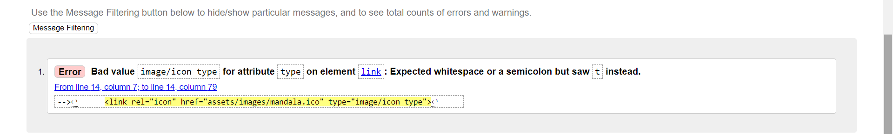

# Vapika Dosha Quiz Testing

## TABLE OF CONTENTS

1) [Manual Testing](TESTING.md/#1-manual-testing)
    - [Internal events/links](TESTING.md/#internal-eventslinks)
    - [External links](TESTING.md/#external-links)
    - [EmailJS](TESTING.md/#emailjs)
    - [Quiz and quiz result](TESTING.md/#quiz--quiz-result)
2) [Code Validation](TESTING.md/#2-code-validation)
    - [W3C HTML Validation](TESTING.md/#w3c-html-validation)
    - [W3C (Jigsaw) CSS Validation](TESTING.md/#w3c-jigsaw-css-validation)
    - [JSHint JavaScript Validation](TESTING.md/#jshint-javascript-validation)
3) [Responsiveness testing](TESTING.md/#3-responsiveness-testing)
    - [Homepage responsiveness](TESTING.md/#homepage-responsiveness)
    - [Homepage modal windows responsiveness](TESTING.md/#homepage-modal-windows-responsiveness)
    - [Quiz responsiveness](TESTING.md/#quiz-responsiveness)
    - [Signup page responsiveness](TESTING.md/#signup-page-responsiveness)
    - [Quiz result responsiveness](TESTING.md/#quiz-result-responsiveness)
    - [Dosha modal windows responsiveness](TESTING.md/#dosha-modal-window-responsiveness)
4) [Browser compatibility](TESTING.md/#4-browser-compatibility)
5) [Bugs and fixes](TESTING.md/#5-bugs-and-fixes)
6) [Lighthouse reports](TESTING.md/#6-ligthouse-reports)
7) [User testing](TESTING.md/#7-user-testing)

[⬅ Back to the README.md file](README.md)
- - - 
## 1) MANUAL TESTING

### INTERNAL EVENTS/LINKS

- ##### LEARN MORE AND INSTRUCTIONS BUTTONS AND MODAL WINDOWS

-The Learn More and Instructions buttons successfully open the modal windows

-The modal windows correctly close either triggered by the close x click or by clicking anywhere outside of the modal windows
- - -
- #### SELECT AND DESELECT ANSWERS

-The "take quiz" button successfully links to the quiz page

-When selected, the answer acquires the right style 

-The previous answer correctly deselects if the user changes answer
- - - 
- #### MANDATORY ANSWER

The quiz requires all of the questions to be answered:
the go to the next question button click correctly triggers the check for an answer to be selected and perfectly displays the SweetAlert window if not.
- - - 
- #### SIGNUP FORM INPUTS VALIDATION

The text and email inputs in the Newsletter signup form are validated
- - - 
- #### SIGNUP SWEETALERT WINDOW

If the signup form is correctly submitted, the SweetAlert window successfully shows up for the right amount of time set in the timer (4secs) and redirects to the results page.
- - - 
- #### PIE CHART

The Pie chart in the results page behaves as planned/as it's supposed to:

-On hover, the pie chart slices show the corresponding dosha name, number of answers scored and percentage.

-On click, the slice correctly opens the modal window containing the information for that specific dosha
- - - 
### EXTERNAL LINKS

All social media icon links open on a new page.
- - - 
### EMAILJS

The signup form submission successfully sends a confirmation email to the user based on the email address stated in the form.

Also the username is shown to be correctly stored and displayed in the email intro.

To make sure the feature is working, I tested it using various email addresses (mine or relative's/friend's) ones and different names.
- - -
### QUIZ & QUIZ RESULT
The quiz logic revolves around the concept that the user dominant doshas are the ones that get more answers: each question has three possible answers and each answer corresponds to a specific dosha. 
To make things easier, answer 1 [0] always corresponds to Vata, answer 2[1] to Pitta and answer 3 [2] to Kapha.

Knowing this, I manually tested all of the possible combinations, including a Tridoshic case (all doshas get equal points) to make sure the results are being calculated correctly.

[Back to top ↑](TESTING.md/#vapika-dosha-quiz-testing)
- - - 
## 2) CODE VALIDATION

### W3C HTML VALIDATION
- Homepage

- Quiz page

- Signup page

- Results page

All html pages are validated with [W3C HTML validator](https://validator.w3.org/)and come back with no errors or warnings.
- - - 
### W3C (JIGSAW) CSS VALIDATION

CSS code passes through the [JigSaw CSS validator](https://jigsaw.w3.org/css-validator/) without issues.
- - - 
### JSHINT JAVASCRIPT VALIDATION
- Script.js

- Quiz.js

- Sign-up.js

- Results.js

No significant issues come back when the JavaScript code is passed through [JSHint validator](https://jshint.com/).

[Back to top ↑](TESTING.md/#vapika-dosha-quiz-testing)
- - - 
## 3) RESPONSIVENESS TESTING

All of the website pages are fully responsive.

The responsiveness testing has been conducted using Google Chrome Developer Tools, both on the devices available and on "responsive" modality. 
- - - 
- ### HOMEPAGE RESPONSIVENESS

- - - 
- ### HOMEPAGE MODAL WINDOWS RESPONSIVENESS

- - - 
- ### QUIZ RESPONSIVENESS

- - - 
- ### SIGNUP PAGE RESPONSIVENESS

- - - 
- ### QUIZ RESULT RESPONSIVENESS

- - - 
- ### DOSHA MODAL WINDOW RESPONSIVENESS

[Back to top ↑](TESTING.md/#vapika-dosha-quiz-testing)
- - - 
## 4) BROWSER COMPATIBILITY

VAPIKA Dosha Quiz has been tested for browser compatibility on:

 - Google Chrome
 
- - - 
 - Firefox

- - - 
 - Microsoft Edge

- - - 
 - Opera
 

[Back to top ↑](TESTING.md/#vapika-dosha-quiz-testing)
- - - 
## 5) BUGS AND FIXES
### CODE VALIDATION ERRORS AND WARNING

1) Homepage HTML validation error

The first time the homepage HTML was run through the W3C validator service, an error was returned.
Fixed by removing the type attribute in the icon link tag.
- - -

2) Signup page HTML validation errors and warning

The sign-up.html file returned two errors and one warning during the code validation.

The two errors were related to the "method" and "action" attributes in the form element being empty. I decided to remove those attributes because of the default actions of the form element.

The warning was associated to the "type" attribute in the Javascript resources, and fixed by deleting it since it's unnecessary.
- - - 

3) Results page HTML validation errors and warning

In the results page, the two errors that came back during the code validation were related to the content of the Pitta dosha and Kapha dosha in the modal windows: the unordered list containing the dosha triggers was inside of a paragraph. And paragraphs cannot contain lists in html.
To fix it, the opening p tag was closed straight before the list span.

Again, a warning relating the "type" attribute in the Javascript resources was encountered and fixed by removing it.
- - - 
4) JSHint fixed validation issues

The first time I run the scripts into JSHint validator, a considerable amount of missing semicolons was found. All of them has been added in the pointed places.
- - - 

5) 404 Errors after deployment

The deployed website on github-pages was returning 404 errors when trying to access the quiz from the "Take Quiz" button, and when both of the buttons in the signup page were supposed to redirect to the results page.

The issue showed itself in proximity/during my second mentor call, and it was fixed thanks to my mentor help.

It was clear that the problem was in the file paths I had used to link to the pages stated above: after trying different approaches, the deployed website accepted as a file path to the root directory the format "./filename.html", and the 404 issues were fixed.
- - - 
6) Footer floating in the middle of the screen

I started to tackle the responsiveness and styling of the webpage only after the second mentor call for this project, because I wanted to focus on the Javascript functionalities first.
So during that call, my mentor made me notice that the footer of the website was floating in the middle of the page in the homepage, due to the fact that there wasn't enought content to push it to the bottom of the page.

To solve this, the footer has been given a fixed position following the tutorial on [W3schools](https://www.w3schools.com/howto/howto_css_fixed_footer.asp).
- - - 

7) Main content hidden behind footer

After fixing the footer issue and positioning it to "fixed", the content in the main div was staying hidden behind the footer. 

Fixed by adjusting margins and paddins.
- - - 
8) Quiz Tridoshic condition not working

When I started the testing, I noticed that the calculatedosha function wasn't working correctly: in fact, when all of the doshas scored the same amount of points, the "Tridoshic" result wasn't calculated as it was supposed to.

It was fixed by adding to the condition an AND operator to evaluate vata dosha being equal to pitta dosha AND vata dosha being equal to kapha dosha.

[Back to top ↑](TESTING.md/#vapika-dosha-quiz-testing)
- - - 
## 6) LIGTHOUSE REPORTS

All of the website pages have been also tested using [Lighthouse Chrome Developer Tool](https://chrome.google.com/webstore/detail/lighthouse/blipmdconlkpinefehnmjammfjpmpbjk?hl=en).

They all score above 90 in all of the categories: Performance, Accessibility, Best Practices and SEO.

- Homepage lighthouse report

- Quiz page lighthouse report

- Signup page lighthouse report

- Results page lighthouse report

- - - 

## 7) USER TESTING
The website has also been sent to family, friends and peers on Slack.
The response/review was very positive and no issues were encountered on their devices.

[Back to top ↑](TESTING.md/#vapika-dosha-quiz-testing)

[⬅ Back to the README.md file](README.md)