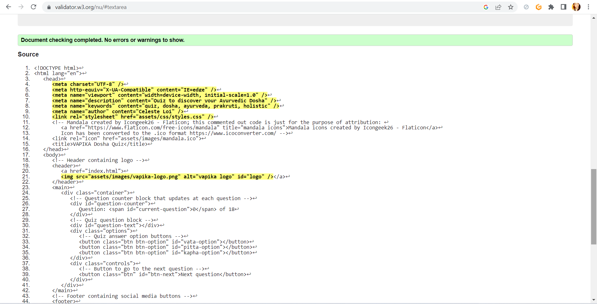
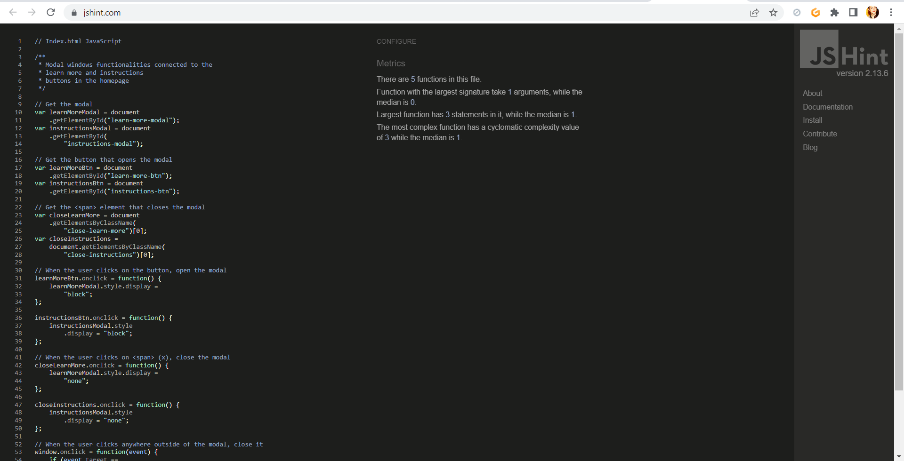
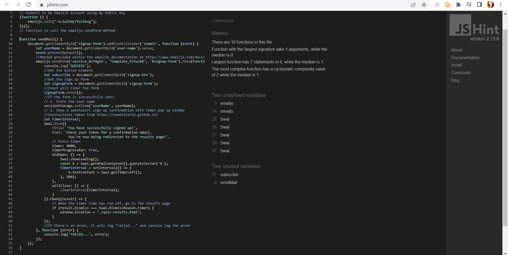

# Vapika Dosha Quiz Testing

## TABLE OF CONTENTS

1) [Manual Testing](TESTING.md/#1-manual-testing)
    - [Internal events/links](TESTING.md/#internal-eventslinks)
    - [External links](TESTING.md/#external-links)
    - [EmailJS](TESTING.md/#emailjs)
    - [Quiz and quiz result](TESTING.md/#quiz--quiz-result)
2) [Code Validation](TESTING.md/#2-code-validation)
    - [W3C HTML Validation](TESTING.md/#w3c-html-validation)
    - [W3C (Jigsaw) CSS Validation](TESTING.md/#w3c-jigsaw-css-validation)
    - [JSHint JavaScript Validation](TESTING.md/#jshint-javascript-validation)
3) [Responsiveness testing](TESTING.md/#3-responsiveness-testing)
    - [Homepage responsiveness](TESTING.md/#homepage-responsiveness)
    - [Quiz responsiveness](TESTING.md/#quiz-responsiveness)
    - [Signup page responsiveness](TESTING.md/#signup-page-responsiveness)
    - [Quiz result responsiveness](TESTING.md/#quiz-result-responsiveness)
    - [Modal windows responsiveness](TESTING.md/#modal-window-responsiveness)
4) [Browser compatibility](TESTING.md/#4-browser-compatibility)
5) [Bugs and fixes](TESTING.md/#5-bugs-and-fixes)
6) [Lighthouse reports](TESTING.md/#6-ligthouse-reports)
7) [User testing](TESTING.md/#7-user-testing)

[⬅ Back to the README.md file](README.md)
- - - 
## 1) MANUAL TESTING

### INTERNAL EVENTS/LINKS

- ##### LEARN MORE AND INSTRUCTIONS BUTTONS AND MODAL WINDOWS

-The Learn More and Instructions buttons successfully open the modal windows

-The modal windows correctly close either triggered by the close x click or by clicking anywhere outside of the modal windows
- - -
- #### SELECT AND DESELECT ANSWERS

-The "take quiz" button successfully links to the quiz page

-When selected, the answer acquires the right style 

-The previous answer correctly deselects if the user changes answer
- - - 
- #### MANDATORY ANSWER

The quiz requires all of the questions to be answered:
the go to the next question button click correctly triggers the check for an answer to be selected and perfectly displays the SweetAlert window if not.
- - - 
- #### SIGNUP FORM INPUTS VALIDATION

The text and email inputs in the Newsletter signup form are validated
- - - 
- #### SIGNUP SWEETALERT WINDOW

If the signup form is correctly submitted, the SweetAlert window successfully shows up for the right amount of time set in the timer (4secs) and redirects to the results page.
- - - 
- #### PIE CHART

The Pie chart in the results page behaves as planned/as it's supposed to:

-On hover, the pie chart slices show the corresponding dosha name, number of answers scored and percentage.

-On click, the slice correctly opens the modal window containing the information for that specific dosha
- - - 
### EXTERNAL LINKS

All social media icon links open on a new page.
- - - 
### EMAILJS

The signup form submission successfully sends a confirmation email to the user based on the email address stated in the form.

Also the username is shown to be correctly stored and displayed in the email intro.

To make sure the feature is working, I tested it using various email addresses (mine or relative's/friend's) ones and different names.
- - -
### QUIZ & QUIZ RESULT
The quiz logic revolves around the concept that the user dominant doshas are the ones that get more answers: each question has three possible answers and each answer corresponds to a specific dosha. 
To make things easier, answer 1 [0] always corresponds to Vata, answer 2[1] to Pitta and answer 3 [2] to Kapha.

Knowing this, I manually tested all of the possible combinations, including a Tridoshic case (all doshas get equal points) to make sure the results are being calculated correctly.
- - - 
## 2) CODE VALIDATION

### W3C HTML VALIDATION
- Homepage

- Quiz page

- Signup page

- Results page

All html pages are validated and come back with no errors or warnings.
- - - 
### W3C (JIGSAW) CSS VALIDATION

CSS code passes through the JigSaw validator without issues.

### JSHINT JAVASCRIPT VALIDATION
- Script.js

- Quiz.js

- Sign-up.js

- Results.js

No significant issues come back when the JavaScript code is passed through JSHint.
- - - 
## 3) RESPONSIVENESS TESTING
 All of the responsiveness testing has been conducted using Google Chrome Developer Tools and its devices and "responsive" modality. 

- Homepage

- Homepage modal windows responsiveness

- Quiz page

- Signup page

- Results page

- Dosha modal windows

### HOMEPAGE RESPONSIVENESS

### QUIZ RESPONSIVENESS

### SIGNUP PAGE RESPONSIVENESS

### QUIZ RESULT RESPONSIVENESS

### MODAL WINDOW RESPONSIVENESS

## 4) BROWSER COMPATIBILITY

## 5) BUGS AND FIXES

## 6) LIGTHOUSE REPORTS

## 7) USER TESTING